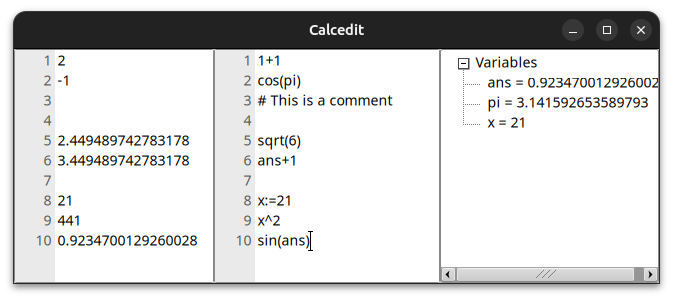

# Calcedit

Calcedit is a non-skeuomorphic calculator, inspired by Google Chrome's search bar (i.e. display the result in real-time while typing), but with multiple lines, just like a text editor (hence the name) and variables.

The editor is in the middle. On the left you see the results for each line and on the right it shows the latest values of all used variables, where `pi` is predefined and `ans` is the latest result, similar to a regular calculator.

The math parsing is provided by the incredible [exprtk](https://www.partow.net/programming/exprtk/).
