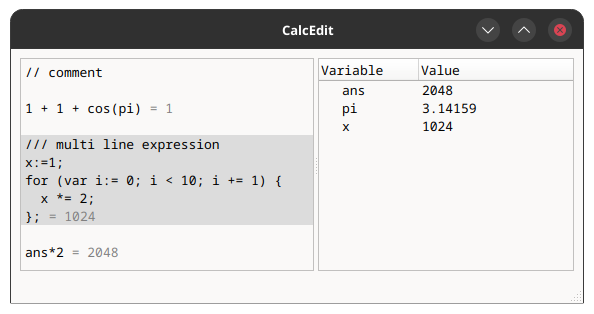
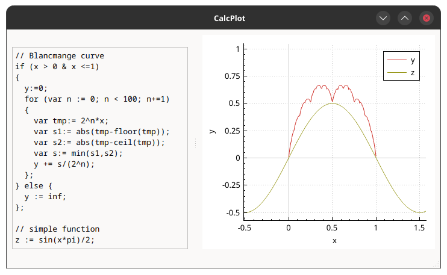

# Calcedit

Calcedit is a non-skeuomorphic calculator, inspired by Google Chrome's search bar (i.e. display the result in real-time while typing), but with multiple lines, just like a text editor (hence the name) and variables.

The editor is on the left, with the result on each line or multi-line expression and on the right it shows the latest values of all used variables, where `pi` is predefined and `ans` is the latest result, similar to a regular calculator.

The math parsing is provided by the incredible [exprtk](https://www.partow.net/programming/exprtk/).

# Calcplot

Calcplot is a real-time function plotter based on [exprtk](https://www.partow.net/programming/exprtk/) and [QCustomPlot](https://www.qcustomplot.com).
Each assigned variable gets plottet. The variable names also appear in the legend.

